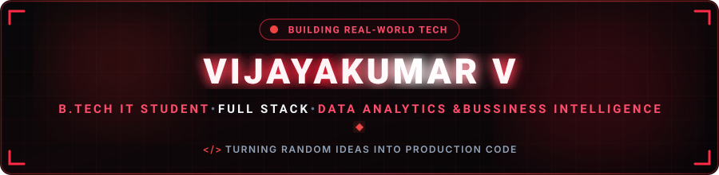
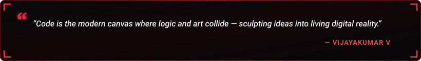

## Hi there 👋

  

  

  
  &nbsp;
  
  &nbsp;
  
  &nbsp;
  
  &nbsp;
  

  

---

<h2 align="center">🔴 About Me</h2>

  

  

  Hey! I'm <b>VIJAYAKUMAR V</b>, a passionate <b>Data Analytics enthusiast &amp; aspiring Data Analyst</b> based in India. 
  I specialize in analyzing complex datasets, creating insightful data visualizations, building interactive dashboards, and using data-driven techniques to solve real-world problems.

  
  &nbsp;
  
  &nbsp;
  

  💬 <b>Let's Discuss:</b> Data Analytics, Python, SQL, Excel, Power BI, Tableau, Data Visualization &amp; Machine Learning. 
  ⚡ <b>Philosophy:</b> <i>"I love turning raw data into meaningful insights that solve real-world problems!"</i>

<table width="100%" border="0" align="center">
<tr>
<td width="50%" align="center" style="padding: 14px;">
  <h4>🔭 Flagship Project</h4>
  
<a href="https://opencore-mastitis-monitor.vercel.app/" target="_blank"><b>OpenCore Monitor</b></a> Dairy IoT &amp; Anomaly Detection

</td>
<td width="50%" align="center" style="padding: 14px;">
  <h4>🌱 Active Deep Dives</h4>
  
<b>Python, SQL &amp; Power BI</b> Dashboards &amp; Data Visualization

</td>
</tr>
<tr>
<td width="50%" align="center" style="padding: 14px;">
  <h4>📱 Instagram</h4>
  
<a href="https://www.instagram.com/offx.ajuu__?vrfl=MW0waGZlaTJlZ3gxZA==" target="_blank"><b>@offx.ajuu__</b></a> Updates &amp; Creative Work

</td>
<td width="50%" align="center" style="padding: 14px;">
  <h4>🤝 Collaboration</h4>
  
<b>Data Analytics &amp; Machine Learning</b> Open to exciting new projects

</td>
</tr>
</table>

---

<h2 align="center">🔴 Featured Project Spotlight</h2>

<table width="100%" border="0" align="center">
<tr>
<td align="center" style="padding: 22px;">
  <h3>🔬 OpenCore Mastitis Monitor</h3>
  
<i>A smart IoT &amp; web-enabled dairy health monitoring system designed for early anomaly detection and real-time livestock welfare tracking.</i>

   
  

    
    &nbsp;&nbsp;
    
  

</td>
</tr>
</table>

---

<h2 align="center">🧩 LeetCode Problem Solving</h2>

<i>Live real-time tracker of coding challenges &amp; algorithmic problem-solving milestones.</i>

  

  
  &nbsp;&nbsp;
  

---

<h2 align="center">🛠️ Tech Stack &amp; Skills</h2>

<b>Core Programming Languages</b>

  

<b>Frontend &amp; Mobile Development</b>

  

<b>Backend, Cloud &amp; Databases</b>

  

<b>AI, Data Science, Hardware &amp; DevOps</b>

  

  
  &nbsp;
  
  &nbsp;
  
  &nbsp;
  

---

<h2 align="center">📊 GitHub Analytics &amp; Activity</h2>

  
  &nbsp;&nbsp;
  

  

  

---

<h2 align="center">⚡ Contribution Journey</h2>

  

---

<h2 align="center">📬 Let's Connect &amp; Collaborate</h2>

<i>Whether you want to discuss data analytics, explore open-source collaboration, or just say hello — let's connect!</i>

<table border="0" align="center">
<tr>
<td align="center" width="220" style="padding: 16px;">
  <a href="https://www.linkedin.com/in/vijayakumar-velmurugan-09b10642b/" target="_blank">
    
      
    
  </a>
   
  <b>Professional Network</b>
</td>
<td align="center" width="220" style="padding: 16px;">
  <a href="https://www.instagram.com/offx.ajuu__?vrfl=MW0waGZlaTJlZ3gxZA==" target="_blank">
    
      
    
  </a>
   
  <b>Updates &amp; Creative Work</b>
</td>
<td align="center" width="220" style="padding: 16px;">
  <a href="https://github.com/vv162953-ops" target="_blank">
    
      
    
  </a>
   
  <b>Projects &amp; Collaboration</b>
</td>
</tr>
</table>

  

<!--
**vv162953-ops/vv162953-ops** is a ✨ _special_ ✨ repository because its `README.md` (this file) appears on your GitHub profile.

Here are some ideas to get you started:

- 🔭 I’m currently working on ...
- 🌱 I’m currently learning ...
- 👯 I’m looking to collaborate on ...
- 🤔 I’m looking for help with ...
- 💬 Ask me about ...
- 📫 How to reach me: ...
- 😄 Pronouns: ...
- ⚡ Fun fact: ...
-->
